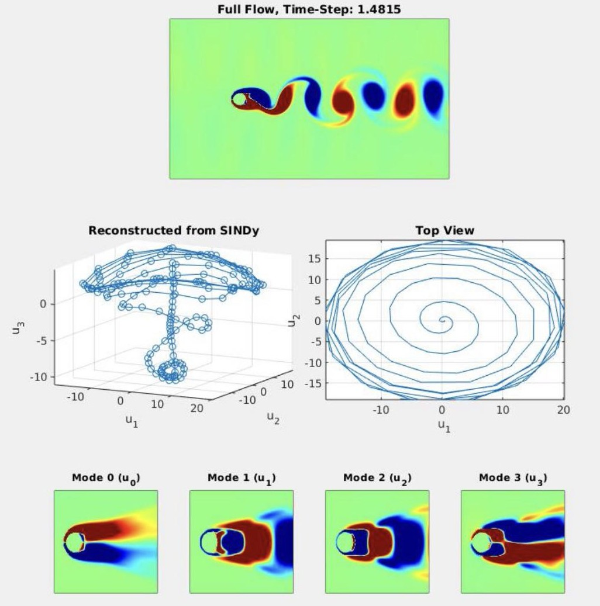

# SINDyCYL
Low-Dimensional Modelling of Flow Past a 2D Cylinder with SINDy

A DNS of the 2D cylinder was simulated using 2D_compressible.f90
```
gfortran 2D_compressible.f90
./a.out
```

Then, run matlab script main.m for postprocessing vorticity files.
```
matlab main
```

main.m find the POD modes and weights using SVD

The POD weights are then fed into the SINDy alogrithm which finds a best fit of a non-linear DE

The non-linear DE is solved using ODE45 and the results are post-processed with full flow


